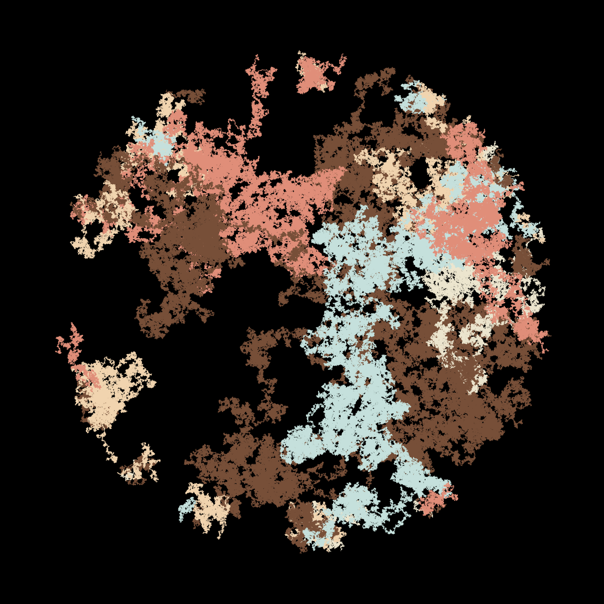

Recently, I've been playing around with some generative music using Propellerhead Reason, mostly for fun, you can find some of it on my Soundcloud:

<iframe width="100%" height="166" scrolling="no" frameborder="no" allow="autoplay" src="https://w.soundcloud.com/player/?url=https%3A//api.soundcloud.com/tracks/1172751727&color=%23ff5500&auto_play=false&hide_related=true&show_comments=false&show_user=true&show_reposts=false&show_teaser=false"></iframe>
<a href="https://soundcloud.com/eprumental" title="Ehsan.Pourhadi" target="_blank" style="color: #cccccc; text-decoration: none;">Ehsan.Pourhadi</a> · <a href="https://soundcloud.com/eprumental/w8-1" title="W8" target="_blank" style="color: #cccccc; text-decoration: none;">W8</a>

This got me to start thinking about some generative art; after some Googling I got to check out some R programming for drawing things, and after some lurking around Github I found some good examples written in go and python too. Got to install R and Processing 3 on my Mac. After trying to get the process working for a few hours, I was not lucky, and after some digging up I saw a lot of problems with the processor 3 and java versions. But v2 worked and i got my first images.
At this point I just want to make some pretty art and not do too much into learning the generative algorithms that are already in place.

